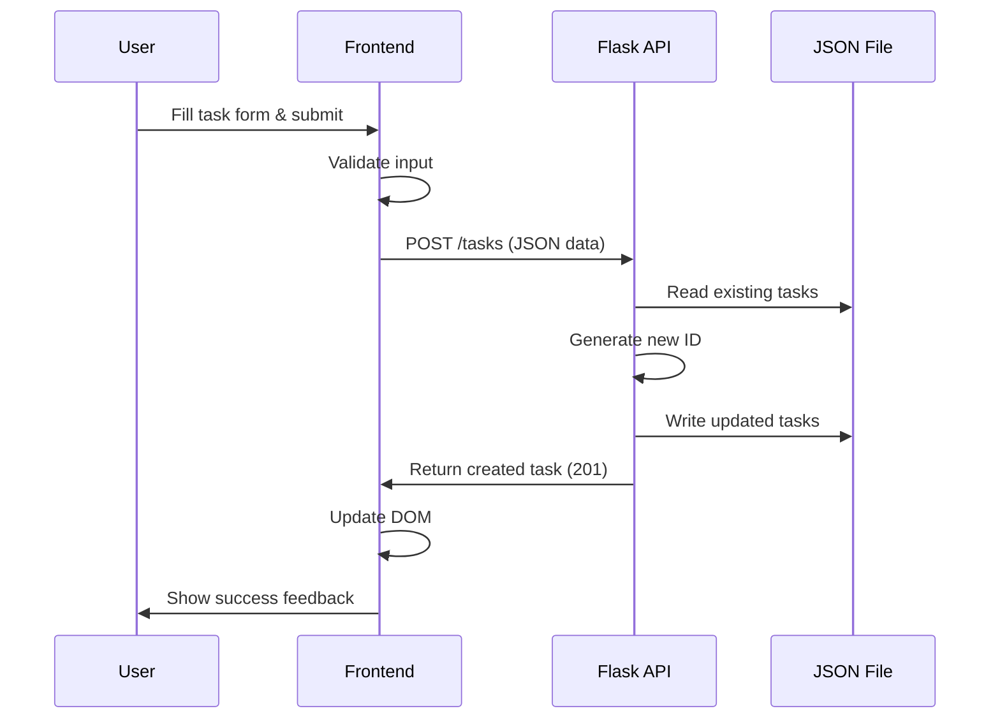
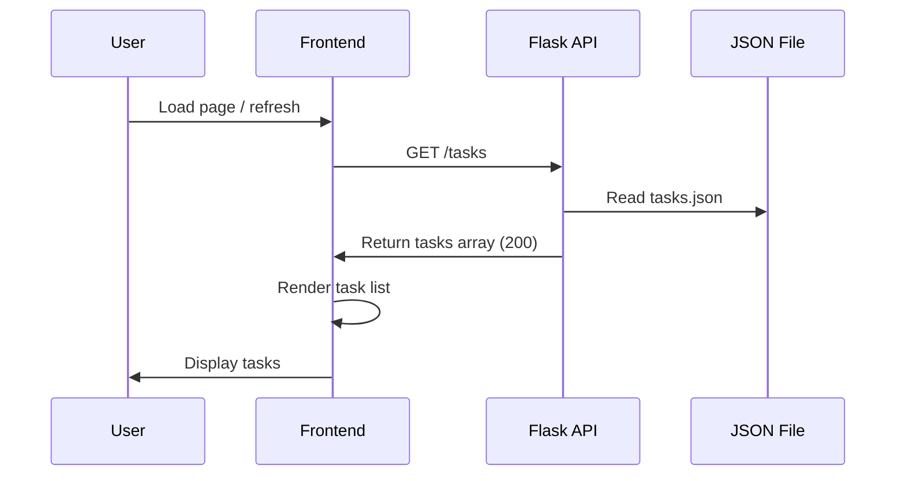
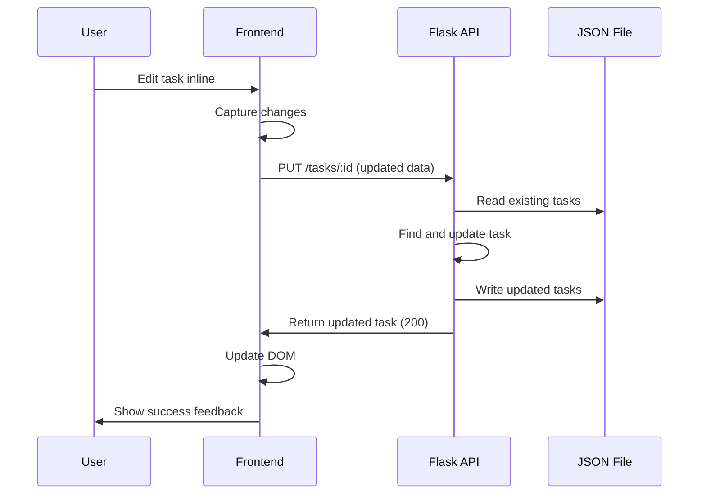
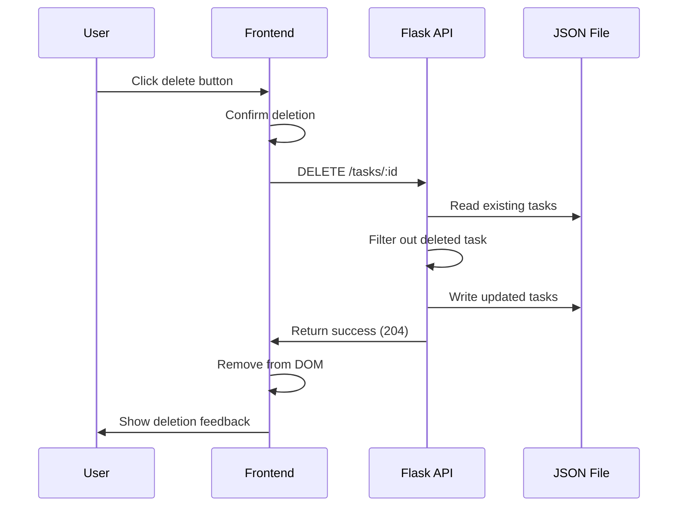
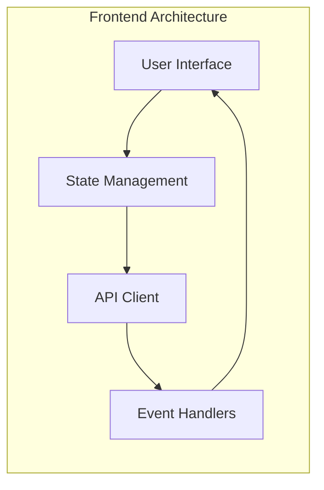
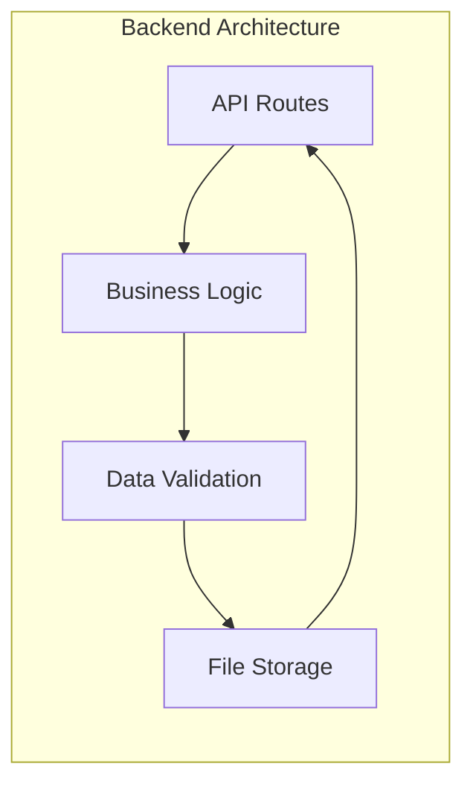

```mermaid
graph TB
    subgraph "User Interface Layer"
        Browser[Web Browser]
        subgraph "Frontend Application"
            HTML[index.html<br/>- Task Form<br/>- Task List<br/>- Progress Tab<br/>- Filters]
            CSS[style.css<br/>- Transformers Theme<br/>- Responsive Design<br/>- Animations]
            JS[app.js<br/>- API Calls<br/>- DOM Updates<br/>- Event Handling<br/>- State Management]
        end
    end

    subgraph "Application Layer"
        subgraph "Flask Web Server"
            FlaskApp[app.py]
            subgraph "API Endpoints"
                GET[GET /tasks<br/>Read All Tasks]
                POST[POST /tasks<br/>Create Task] 
                PUT[PUT /tasks/:id<br/>Update Task]
                DELETE[DELETE /tasks/:id<br/>Delete Task]
            end
            subgraph "Core Functions"
                LoadTasks[load_tasks()]
                SaveTasks[save_tasks()]
                GetNextId[get_next_id()]
                CORS[CORS handling]
            end
        end
    end

    subgraph "Data Persistence Layer"
        subgraph "File System Storage"
            JSON[tasks.json<br/>- Task ID<br/>- Title<br/>- Description<br/>- Due Date<br/>- Status]
        end
    end

    Browser --> HTML
    Browser --> CSS
    Browser --> JS
    
    JS -->|HTTP Requests<br/>CRUD Operations| FlaskApp
    
    FlaskApp --> GET
    FlaskApp --> POST
    FlaskApp --> PUT
    FlaskApp --> DELETE
    
    GET --> LoadTasks
    POST --> SaveTasks
    PUT --> LoadTasks
    PUT --> SaveTasks
    DELETE --> LoadTasks
    DELETE --> SaveTasks
    
    LoadTasks -->|File Read| JSON
    SaveTasks -->|File Write| JSON
    
    FlaskApp -->|JSON Response| JS

    classDef frontend fill:#e1f5fe
    classDef backend fill:#f3e5f5
    classDef storage fill:#e8f5e8
    
    class Browser,HTML,CSS,JS frontend
    class FlaskApp,GET,POST,PUT,DELETE,LoadTasks,SaveTasks,GetNextId,CORS backend
    class JSON storage
```

## Data Flow Diagrams

### Create Task Flow


### Read Tasks Flow


### Update Task Flow


### Delete Task Flow


## System Architecture Components

### Frontend Components


### Backend Components  
